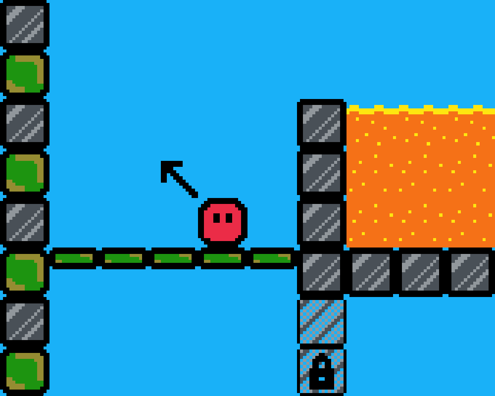

# Spring on Sprig

## Overview

Spring is a game built for Hack Club's [Sprig](https://github.com/hackclub/sprig). The goal is to "spring" yourself around each level in order to collect the coin and progress to the next level.

And yes, the name, Spring, is intentional. It's Spring on Sprig! :)

## Controls

**My goal is for this game to be playable _without_ much prior instruction. If you [try it](https://sprig.hackclub.com/gallery/spring) and find it confusing, please let me know so that I can improve the game down the line.**

With that said, here are some instructions, just in case:

Controls

### IJKL

- **I:** open the directional arrow (this needs to be pressed before every move!)
- **J:** rotate the directional arrow counterclockwise
- **K:** "spring" the player in the direction of the arrow
- **L:** rotate the directional arrow clockwise

### WASD

- **W:** zoom out and pan the map UP
- **A:** zoom out and pan the map LEFT
- **S:** zoom out and pan the map DOWN
- **D:** zoom out and pan the map RIGHT

_To exit zoom mode, press any of the IJKL controls._

Note that, in the game, these controls are referenced by their location on a physical Sprig.

### More Resources

This repository only includes the final game code. All my other commits are located within the official [hackclub/sprig](https://github.com/hackclub/sprig) repository.

Spring is also in the [Sprig gallery](https://sprig.hackclub.com/gallery/spring)!
